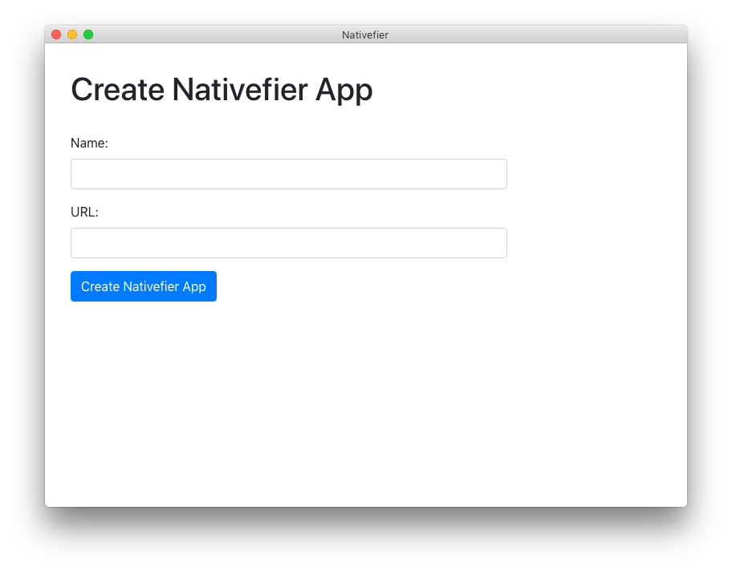

# nativefier-gui

Graphical user interface for [nativefier](https://github.com/nativefier/nativefier). Make any web page a desktop application. 

## Downloads

| macOS                                                                                                                     | Windows                                                                                                                 | Linux                                                                                                                   |
| ------------------------------------------------------------------------------------------------------------------------- | ----------------------------------------------------------------------------------------------------------------------- | ----------------------------------------------------------------------------------------------------------------------- |
| 📦 [64 Bit (Intel)](https://github.com/mattruzzi/nativefier-gui/releases/latest/download/nativefier-gui-darwin-x64.zip)   | 📦 [64 Bit (Intel)](https://github.com/mattruzzi/nativefier-gui/releases/latest/download/nativefier-gui-win32-x64.zip)  | 📦 [64 Bit (Intel)](https://github.com/mattruzzi/nativefier-gui/releases/latest/download/nativefier-gui-linux-x64.zip)  |
|                                                                                                                           | 📦 [32 Bit (Intel)](https://github.com/mattruzzi/nativefier-gui/releases/latest/download/nativefier-gui-win32-ia32.zip) | |
| 📦 [64 Bit (Apple)](https://github.com/mattruzzi/nativefier-gui/releases/latest/download/nativefier-gui-darwin-arm64.zip) | 📦 [64 Bit (Arm)](https://github.com/mattruzzi/nativefier-gui/releases/latest/download/nativefier-gui-win32-arm64.zip)  | 📦 [64 Bit (Arm)](https://github.com/mattruzzi/nativefier-gui/releases/latest/download/nativefier-gui-linux-arm64.zip)  |

## License
